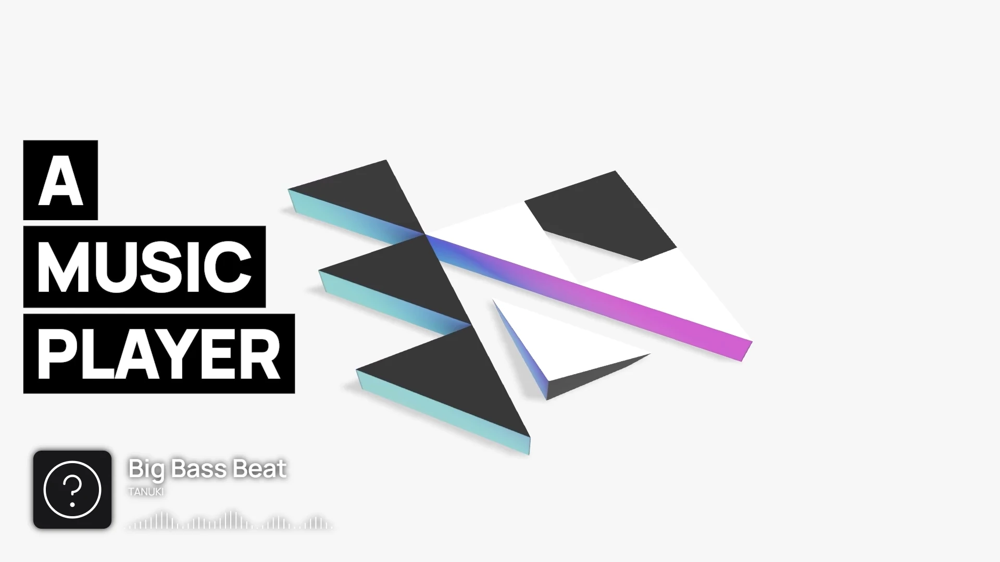

  
  <h3><b>Hyperchroma</b></h1>
  
<b><i>Bring your music to life.</i></b>

  
A desktop music player that animates music and images into real-time music videos.

  

    <a href='https://hyperchroma.app' target='_blank' rel='noopener noreferrer'>Site</a> •
    <a href='https://github.com/Hyperchroma/hyperchroma/issues' target='_blank' rel='noopener noreferrer'>Issues</a> •
    <a href='https://github.com/Hyperchroma/hyperchroma/discussions' target='_blank' rel='noopener noreferrer'>Forums</a> •
    <a href='https://twitter.com/hyperchroma' target='_blank' rel='noopener noreferrer'>Twitter</a> •
    <a href='https://discord.gg/2RMkM7Az5h' target='_blank' rel='noopener noreferrer'>Discord</a>
  

   
  
   

## About
This repository contains the issues, discussions, and changelogs for Hyperchroma.

## Changelog
You can find the changelog for Hyperchroma [here](/CHANGELOG.md).

## Discussions
Please use the [Discussions](https://github.com/Hyperchroma/hyperchroma/discussions) or [Discord](https://discord.gg/2RMkM7Az5h) to discuss the app.

You may also follow the official [Twitter](https://twitter.com/hyperchroma) for news on updates and releases.

## Reporting Issues
Please use the [issue tracker](https://github.com/Hyperchroma/hyperchroma/issues) to report issues and bugs.

When creating issues, please adhere to the following guidelines:
- Make sure the issue doesn't already exist
- Include your OS and app version
- Include specific steps on how to reproduce the bug if possible
